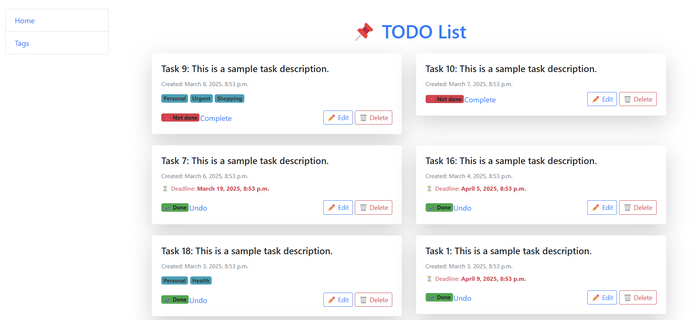

# IT Project manager

Simple project for managing your task. You can create, update, and change status of tasks to stay on schedule.

## Installing

Python3 must be installed

```shell
git clone https://github.com/NazarSlavych/todo-list.git
cd todo-list
python3 -m venv venv
source venv/bin/activate
pip install -r requirements.txt
python manage.py runserver # starts Django server
```

## Features
What Our Todo List Can Do:
* Task Management – create, update, and delete tasks effortlessly
* Status Control – mark tasks as complete or undo them with a single click
* Organized Workflow – view tasks sorted by status and creation date
* Tag System – categorize tasks with tags for better organization
* Seamless Navigation – sidebar access to tasks and tags for quick management

🚀 Stay productive and keep your tasks under control!

## Demo

